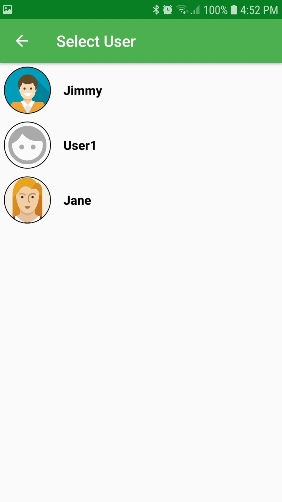
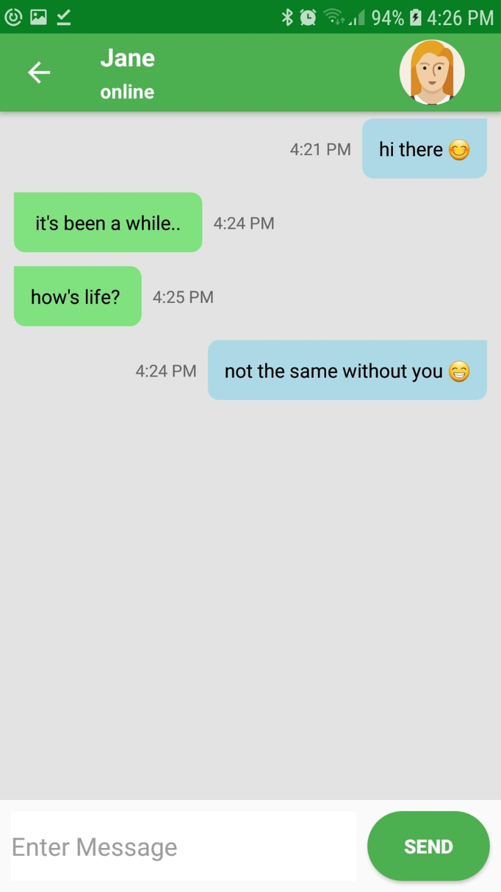
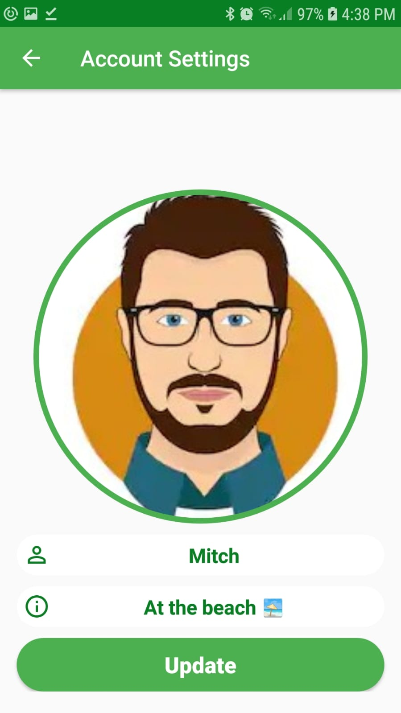

# SilverChat

We all use messaging apps such as Whatsapp and Telegram, so I was eager to start developing one as well.
This is just a basic app for learning purposes and I plan on adding more features gradually.

SilverChat contains:

- Firebase Storage and Realtime Database, holding users messaging data and images.
- Firebase Auth + AuthUI, for a simple registration and login/logout process.
- List of chats, with latest message text + unread message count.
- User can update their info (name, status and photo) in Settings Activity.
- Indicator for knowing if user is online and when last seen
- View other users info when clicking on Chat Activity toolbar.
- Multiple recyclerview row layouts, sender and receiver.
- DateUtils class for human friendly message formatting.

# Recommended Libraries Used
Groupie - setup recyclerview adapter easily.  
Image Cropper - easy image editing tool upon upload.  
CircleImageView - great for chat style round images  
Picasso - ImageView loading & caching.

# Future Plans
- Delete message for me/everyone.
- Clear all chat messages.
- Attach chat photos & files
- Group messaging

 

 

Feel free to fire Pull Requests!
